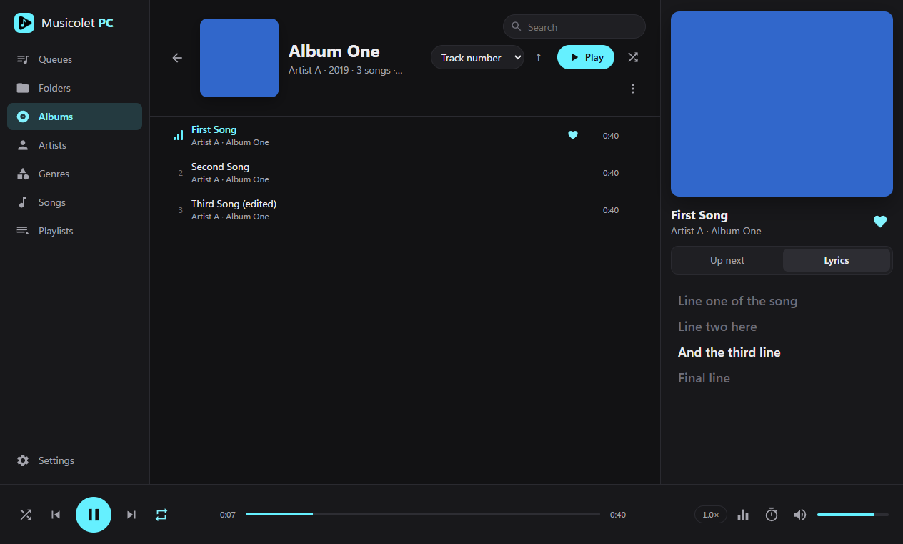
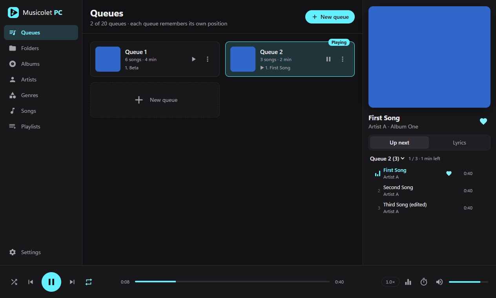
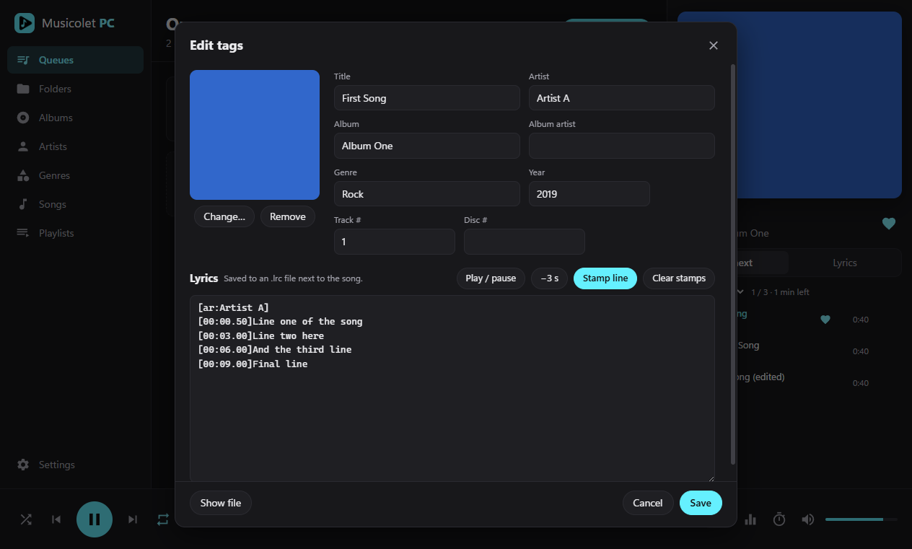

# Musicolet PC

A fast, **offline** desktop music player for Windows (also runs on macOS and Linux), inspired by
[Musicolet](https://krosbits.in/musicolet/) for Android. No ads, no accounts, no internet: it just plays the music files on your computer.

> Unofficial fan project. Not affiliated with Krosbits or the Musicolet app.



## Features

Built to match what makes Musicolet great:

| | |
|---|---|
| **Multiple queues** | Up to 20 queues. Each remembers its own song and position, so you can switch between them without losing your place. Drag songs onto a queue, reorder by dragging, shuffle, or save a queue as a playlist. |
| **Library tabs** | Queues · Folders · Albums · Artists · Genres · Songs · Playlists |
| **Two folder modes** | *Tree* (browse like File Explorer) or *All folders* (every folder that contains music, in one flat list). A `.nomedia` file hides a folder. |
| **Lyrics** | Reads embedded lyrics and `.lrc` files. Synced lyrics scroll and highlight in time; click a line to jump to it. |
| **Synced-lyrics maker** | In the tag editor, play the song and press **Stamp line** (Ctrl+Enter) as each line is sung. |
| **Tag editor** | Edit title, artist, album, album artist, genre, year, track/disc numbers, album art and lyrics, for one song or many at once. |
| **Equalizer** | 10-band EQ plus preamp and 14 presets (Rock, Pop, Jazz, Bass boost, Vocal, …). |
| **Sleep timer** | Stop after X minutes (optionally letting the song finish) or after X songs. |
| **Playlists** | Your own playlists plus automatic ones: Favorites, Recently added, Most played, Recently played, Never played. Import and export `.m3u` / `.m3u8`. |
| **Quick search & sorting** | Every list has a search box and sort options (title, artist, album, year, duration, date added, file name, play count…). |
| **Multi-select** | Click, Ctrl+click, Shift+click, Ctrl+A, **Invert selection**, then act on all selected songs at once. |
| **Playback** | Speed control (0.5×–2×), repeat queue / repeat one, configurable previous button, resumes where you left off, media keys and the Windows media overlay. |
| **Discord Rich Presence** | Optional "Listening to" status on your Discord profile with the song, artist and a live progress bar. Off by default. |
| **Themes** | Dark, Black (AMOLED) and Light, with any accent color. |

Supported formats: **MP3, FLAC, OGG, Opus, M4A/AAC, WAV, WebM**.

<p float="left">
  
  
</p>

---

## Setup tutorial

### 1. Install Node.js (one time)

Download the **LTS** version from <https://nodejs.org> and install it with the default options.
To check that it worked, open a terminal (on Windows, press <kbd>Win</kbd>, type **PowerShell** and press Enter) and run:

```bash
node -v
```

You should see a version number such as `v22.x.x`.

### 2. Download Musicolet PC

**Option A, with Git:**

```bash
git clone https://github.com/mistershenterry/musicolet-pc.git
```

```bash
cd musicolet-pc
```

**Option B, without Git:** on the GitHub page click **Code → Download ZIP**, extract it, then open a terminal in the extracted `musicolet-pc` folder. (In File Explorer, open the folder, click the address bar, type `powershell` and press Enter.)

### 3. Install and run

```bash
npm install
```

```bash
npm start
```

`npm install` is only needed the first time (and after updating). It downloads Electron (~100 MB).
After that, `npm start` launches the player.

### 4. Add your music

On first launch click **Add music folder** and choose the folder where your music lives (for example `C:\Users\<you>\Music`).
You can add more folders later in **Settings → Library**. The library is rescanned automatically every time the app starts, and you can also rescan manually from Settings.

### 5. (Optional) Build a real Windows app

To get an installer and a portable `.exe` you can pin to the taskbar and run without a terminal:

```bash
npm run dist
```

The files appear in the `dist` folder:
- `Musicolet PC Setup 1.0.0.exe` is an installer that adds Start menu and desktop shortcuts.
- `Musicolet PC 1.0.0.exe` is a portable version: one file, no installation.

(macOS: `npm run dist:mac` · Linux: `npm run dist:linux`)

### Updating

If you used Git:

```bash
git pull
```

```bash
npm install
```

---

## How to use

- **Double-click** a song to play that list in the current queue. (You can change this in Settings: play in a new queue, play next, or add to the end.)
- **Right-click** any song, album, artist, folder or playlist for *Play next*, *Add to queue*, *Add to playlist*, *Edit tags*, *Go to album / artist / folder*, *Show in Explorer*, and more.
- **Drag** songs into the *Up next* panel, onto a queue card, or into a playlist. Drag inside a queue to reorder.
- Click the **album art** to view it full size and save it.
- Click the song title / artist in the now-playing panel to jump to its album / artist.

### Keyboard shortcuts

| Key | Action |
|---|---|
| <kbd>Space</kbd> | Play / pause |
| <kbd>Ctrl</kbd> + <kbd>→</kbd> / <kbd>←</kbd> | Next / previous song |
| <kbd>Shift</kbd> + <kbd>→</kbd> / <kbd>←</kbd> | Seek ±10 seconds |
| <kbd>Ctrl</kbd> + <kbd>↑</kbd> / <kbd>↓</kbd> | Volume up / down |
| <kbd>M</kbd> | Mute |
| <kbd>F</kbd> | Favorite the current song |
| <kbd>L</kbd> | Toggle lyrics / queue panel |
| <kbd>Ctrl</kbd> + <kbd>F</kbd> | Search the current list |
| <kbd>Ctrl</kbd> + <kbd>A</kbd> | Select all |
| <kbd>Delete</kbd> | Remove selected songs from the queue / playlist |
| <kbd>1</kbd> – <kbd>7</kbd> | Switch tabs |
| <kbd>Alt</kbd> + <kbd>←</kbd> / <kbd>Backspace</kbd> | Go back |
| Media keys | Play / pause / next / previous |

### Lyrics

Musicolet PC looks for lyrics in this order:
1. A `.lrc` file with the same name next to the song (`My Song.mp3` → `My Song.lrc`)
2. Lyrics embedded in the file's tags

Lines with timestamps like `[01:23.45]` are shown as synced lyrics.

### Discord status

Turn it on in **Settings → Discord → Show what I'm listening to on Discord**. Your Discord status then shows
*Listening to Musicolet PC* with the song title, artist and a progress bar. You can choose whether to show "Paused" or hide the
status while playback is paused, and it is removed when you close the app.

It needs the **Discord desktop app** running on the same PC (the browser version of Discord can't receive it).
If Discord starts after Musicolet PC, it connects automatically within a few seconds.
Album covers can't be shown in Discord, because they only exist on your computer.

Want your own name or icon in the status? Create an application at <https://discord.com/developers/applications>
and paste its Application ID into **Settings → Discord → Custom Application ID**.

### Tag editing notes

- **MP3**: all fields, album art and lyrics can be edited.
- **Other formats (FLAC, M4A, OGG…)**: tags are read-only for now, but you can still add or edit lyrics; they are saved as an `.lrc` file next to the song.

---

## Where is my data stored?

Your songs are never moved or changed unless you edit tags or choose *Delete from disk* (which moves files to the Recycle Bin).
Queues, playlists, favorites, play counts and settings are stored in:

- Windows: `%APPDATA%\musicolet-pc\`
- macOS: `~/Library/Application Support/musicolet-pc/`
- Linux: `~/.config/musicolet-pc/`

To keep this data somewhere else (for example on a USB stick next to the portable `.exe`), set the environment variable `MUSICOLET_PC_DATA` to a folder path before starting the app.

## Troubleshooting

- **`npm` is not recognized**: Node.js isn't installed, or the terminal was opened before installing it. Install Node.js, then open a new terminal.
- **A song won't play**: the format may be unsupported (e.g. WMA, ALAC, APE). Convert it to FLAC or MP3.
- **New songs don't show up**: open **Settings → Rescan library**, and make sure the folder is listed under Library.
- **Start fresh**: close the app and delete the data folder listed above.

## Project structure

```
src/
  main/        Electron main process: window, library scanner, tag writer, file protocol
  preload.js   Safe bridge between the UI and the main process
  renderer/    The user interface (plain HTML/CSS/JS, no framework)
    js/        store (state), player (audio + EQ + sleep timer), views (tabs), dialogs, lyrics…
```

Built with [Electron](https://www.electronjs.org/), [music-metadata](https://github.com/Borewit/music-metadata), [node-id3](https://github.com/Zazama/node-id3) and [@xhayper/discord-rpc](https://github.com/xhayper/discord-rpc). Icons from Google's Material Icons (Apache 2.0).

## License

MIT
